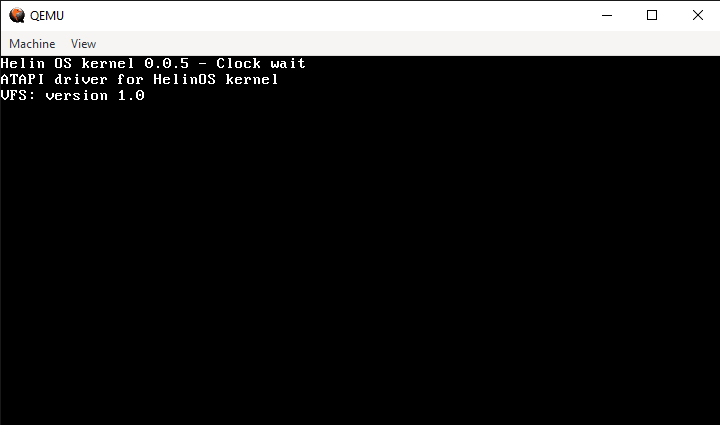
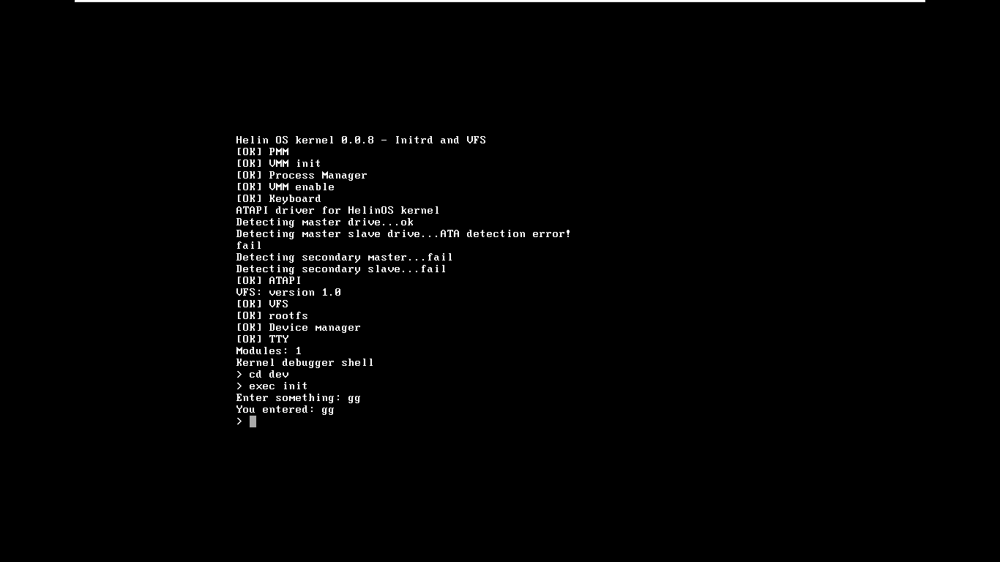

# About
A hobby operation system written in C and assembly.<br>
You can use source of this project :)<br>
Here the screnshot:<br>

<br>Kernel shell:<br>

# Features
Current list of features and released components:
- [x] Global description table
- [x] Interrupts
- [x] Memory Management, PMM
- [x] Multitasking
- [x] Module Loading
- [x] Multiboot structure loading
- [x] User space [in this file](arch/x86/gdtfl.asm)
- [x] Keyboard driver in user space
- [x] Working syscall interface
- [x] Base libc
- [x] VGA
- [x] Virtual memory

# How to build?
- Install any cross-compiler
- Install ```grub-common xorriso grub-efi-ia32```
- If you don't use Windows, then replace all ```\\``` to ```/``` in Makefile, in userland/libc and userland/init Makefiles
- Go to src folder
- Type "make" or if you use Windows, type "mingw32-make"
- If you in Windows you need to install any Linux distribution using virtual machine to make ISO, if not just type "make makeiso"
- If you don't need to create ISO just go to init folder in userland and type ```qemu-system-i386 -kernel ../../src/kernel.bin -initrd init```, if you in Windows replace ```/``` to ```\```
# Bad news
- The Operation System may don't support x86_64 CPU
- Image creation(.iso) available only in linux
# TODO
- More kernel parameters
- Functionally libc
- Add support for mount point, block devices,ramdisk, FAT filesystem, module and shared objects loading
# Changelog
## Drivers
- Added ATA driver, but it can only detect drive not read or write
## VFS
- Add support to rootfs
- Modules are copied to dev folder, so you can execute it.
- Add unimplemented functions for VFS like readBlock,writeBlock
## Multitasking
- Rewrite code, add support to waitPid function
## Terminal
- Added cursor support for BIOS console(BIOS cursor are disabled at terminal init)
## Other
- Added kernel debuger shell
- Change code for multi-architecture(didn't done)